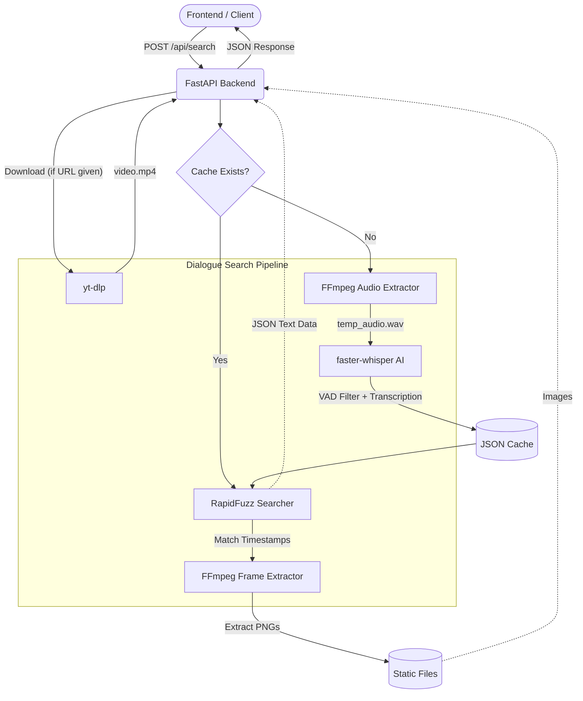

# Video Dialogue Spotter (ASR Pipeline)

## Overview
This project is an automated AI pipeline (`find_dialogue_asr.py`) designed to locate the exact timestamps and video frames where a specific dialogue phrase is spoken in a video. 

Given a target phrase and a video (either downloaded via a URL or provided locally), the pipeline:
1. Downloads the video using `yt-dlp`.
2. Extracts the audio track into a perfectly synchronized `.wav` file.
3. Transcribes the audio using OpenAI's Whisper model (`faster-whisper`), capturing precise word-level timestamps.
4. Uses fuzzy string matching to find the target phrase in the transcription, even if the AI misspelled a word.
5. Extracts the exact starting and ending video frames of the dialogue using `ffmpeg`.

## Problems Faced & Technical Solutions

During development, we encountered several significant technical challenges related to video processing and AI transcription:

### 1. Audio Timescale Drift (The "Squashed Audio" Bug)
**Problem:** When downloading "sparse" web video streams (e.g., from `ok.ru`), the audio track often drops packets during long periods of silence to save bandwidth. When we initially used `ffmpeg` to extract the audio to a WAV file, it ignored these gaps and squashed all the existing audio packets together. This shrunk a 54-minute video into a 53-minute audio track, completely destroying the timeline synchronization and causing Whisper to output timestamps that were 10 to 30 seconds off from the actual video.
**Fix:** We updated the `ffmpeg` audio extraction command to include the filter `-af aresample=async=1:first_pts=0`. This forces FFmpeg to respect the Presentation Timestamps (PTS) and fill any missing gaps with pure silence, ensuring the `.wav` file is perfectly 1:1 synchronized with the video timeline.

### 2. OpenCV Frame Extraction Inaccuracy
**Problem:** We initially used OpenCV (`cv2`) to extract the video frame using the timestamp provided by Whisper. However, OpenCV struggles heavily with Variable Frame Rate (VFR) web videos. It would often "snap" to the nearest keyframe rather than the exact millisecond, resulting in extracted images that were up to 10 seconds away from the actual dialogue scene.
**Fix:** We completely replaced OpenCV with `ffmpeg -ss` for frame extraction. FFmpeg's time-based seeking is flawlessly accurate down to the millisecond, bypassing all VFR and keyframe bugs.

### 3. Out of Memory (OOM) Errors on Long Videos
**Problem:** Processing a full 1-hour movie using the `medium` Whisper model caused the system to run out of memory. 
**Fix:** We switched to the `base` Whisper model and applied `beam_size=1` for greedy decoding. The `base` model is highly memory-efficient while remaining incredibly accurate for English dialogue.

### 4. Minor Transcription Typos Breaking Exact Matches
**Problem:** The Whisper model would occasionally misspell a word (e.g., transcribing "rebels" as "rebells its") or add unexpected punctuation, causing exact string matching searches to fail.
**Fix:** We implemented a sliding-window search using the `rapidfuzz` library. This allows the script to find the target phrase by matching the phonetic/character similarity, easily ignoring minor AI typos and punctuation differences.

### 5. Slow Iteration on the Same Video
**Problem:** If the user wanted to search for a second quote in the same video, the script would waste several minutes re-extracting the audio and re-running the heavy Whisper model.
**Fix:** We implemented a **Transcription Cache**. The script now saves the word-level timestamps to a `video.mp4.transcription.json` file. Subsequent runs on the same video instantly load this cache, allowing new phrases to be searched in milliseconds.

## Example Output

**Target Phrase:** `"My mind rebels at stagnation"`  
**Source Video:** `ok.ru/video/248244667877` (Sherlock Holmes - Scandal in Bohemia)

```text
Loading faster-whisper model (base)...
Extracting perfectly synced audio using ffmpeg...
Transcribing audio (this may take a while)...
Saving transcription cache to video.mp4.transcription.json...
=== Step 4: Extracting Start & End Frames ===
Extracting frame at timestamp 324.84s using ffmpeg to start_frame.png...
Extracting frame at timestamp 327.88s using ffmpeg to end_frame.png...

========================================
FINAL SUCCESSFUL OUTPUT:
Start Timestamp : 00:05:24.839
Start Frame     : 7788
End Timestamp   : 00:05:27.879
End Frame       : 7861
FPS             : 23.98
Spoken Text     : "my mind rebells its stagnation."
Saved Images    :
  - D:\Assignment\Quest1_sanjeev\start_frame.png
  - D:\Assignment\Quest1_sanjeev\end_frame.png
========================================
Total pipeline execution time: 354.28 seconds
```

### Subsequent Cached Runs (Lightning Fast)

Because of the **Transcription Cache**, searching for new phrases in the same video takes just ~1.3 seconds, instantly bypassing the entire Whisper transcription process.

**Target Phrase:** `"what is it it is a plumbers rocket madam'"`
```text
Loading cached transcription from video.mp4.transcription.json...
=== Step 4: Extracting Start & End Frames ===
Extracting frame at timestamp 2538.66s using ffmpeg to start_frame.png...
Extracting frame at timestamp 2544.16s using ffmpeg to end_frame.png...

========================================
FINAL SUCCESSFUL OUTPUT:
Start Timestamp : 00:42:18.659
Start Frame     : 60867
End Timestamp   : 00:42:24.159
End Frame       : 60999
FPS             : 23.98
Spoken Text     : "what is it? it is a plumber's rocket, madden."
========================================
Total pipeline execution time: 1.34 seconds
```

**Target Phrase:** `"his name is goddfrey norton of the inner temple "`
```text
Loading cached transcription from video.mp4.transcription.json...
=== Step 4: Extracting Start & End Frames ===
Extracting frame at timestamp 1528.48s using ffmpeg to start_frame.png...
Extracting frame at timestamp 1530.88s using ffmpeg to end_frame.png...

========================================
FINAL SUCCESSFUL OUTPUT:
Start Timestamp : 00:25:28.480
Start Frame     : 36647
End Timestamp   : 00:25:30.880
End Frame       : 36704
FPS             : 23.98
Spoken Text     : "is a mr. godfrey norton of the inner temple."
========================================
Total pipeline execution time: 1.33 seconds
```

**Target Phrase:** `"this is not it "`
```text
Loading cached transcription from video.mp4.transcription.json...
=== Step 4: Extracting Start & End Frames ===
Extracting frame at timestamp 2806.00s using ffmpeg to start_frame.png...
Extracting frame at timestamp 2808.30s using ffmpeg to end_frame.png...

========================================
FINAL SUCCESSFUL OUTPUT:
Start Timestamp : 00:46:46.000
Start Frame     : 67277
End Timestamp   : 00:46:48.300
End Frame       : 67332
FPS             : 23.98
Spoken Text     : "this is not it."
========================================
Total pipeline execution time: 1.37 seconds
```

**Target Phrase:** `"i kept it only to safeguard myself and preserve weapon which will secure me from any steps he takes "`
```text
Loading cached transcription from video.mp4.transcription.json...
=== Step 4: Extracting Start & End Frames ===
Extracting frame at timestamp 2957.40s using ffmpeg to start_frame.png...
Extracting frame at timestamp 2964.76s using ffmpeg to end_frame.png...

========================================
FINAL SUCCESSFUL OUTPUT:
Start Timestamp : 00:49:17.400
Start Frame     : 70907
End Timestamp   : 00:49:24.760
End Frame       : 71083
FPS             : 23.98
Spoken Text     : "kept it only to safeguard myself and to preserve a weapon which will always secure me from any steps"
========================================
Total pipeline execution time: 1.41 seconds
```

### Summary Table of Test Cases

All test cases were run on the video **Sherlock Holmes - Scandal in Bohemia** (`ok.ru/video/248244667877`).

| Target Input Phrase | Actual Spoken Text Detected | Start Timestamp | End Timestamp |
| :--- | :--- | :--- | :--- |
| `"My mind rebels at stagnation"` | `"my mind rebells its stagnation."` | `00:05:24.839` | `00:05:27.879` |
| `"what is it it is a plumbers rocket madam'"` | `"what is it? it is a plumber's rocket, madden."` | `00:42:18.659` | `00:42:24.159` |
| `"his name is goddfrey norton of the inner temple "` | `"is a mr. godfrey norton of the inner temple."` | `00:25:28.480` | `00:25:30.880` |
| `"this is not it "` | `"this is not it."` | `00:46:46.000` | `00:46:48.300` |
| `"i kept it only to safeguard myself and preserve weapon which will secure me from any steps he takes "` | `"kept it only to safeguard myself and to preserve a weapon which will always secure me from any steps"` | `00:49:17.400` | `00:49:24.760` |

---

## 🏗️ Architecture Diagram

Below is the high-level architecture of the dialogue search pipeline and how the FastAPI backend interacts with the various components:



---

## 🌐 FastAPI Backend Integration

We built a **FastAPI** backend to expose this powerful pipeline to frontend applications. 

### Running the Server

Start the backend by running the `uvicorn` ASGI server:
```bash
python -m uvicorn app:app --port 8000
```
*(The API will be hosted at `http://localhost:8000`)*

### Endpoint Usage

**`POST /api/search`**

Send a JSON payload with the phrase you want to find. If you provide a `"video_url"`, the backend will automatically download it in the background using `yt-dlp`. If you only provide a `"video_path"`, it will search a local file on your computer.

#### Request Schema:
```json
{
  "phrase": "the exact dialogue you want to find",
  "video_url": "https://www.youtube.com/watch?v=...", 
  "video_path": "test_video.mp4",
  "threshold": 80.0
}
```
*(Only `"phrase"` is strictly required!)*

#### Response Schema:
The backend returns the exact timing boundaries, the actual spoken text from the video, and static URLs to the extracted frames:
```json
{
  "success": true,
  "match_score": 93.10,
  "spoken_text": "my mind rebels its stagnation.",
  "start_timestamp": "00:05:25.139",
  "start_frame": 7796,
  "end_timestamp": "00:05:27.740",
  "end_frame": 7858,
  "fps": 23.97,
  "images": {
    "start_frame_url": "http://localhost:8000/static/start_frame.png",
    "end_frame_url": "http://localhost:8000/static/end_frame.png"
  },
  "message": null
}
```

> [!TIP]
> If you query the same `"video_path"` twice, the backend intelligently reads from the `.transcription.json` cache on your hard drive, bypassing the AI model completely and returning results in **~1.3 seconds**.
